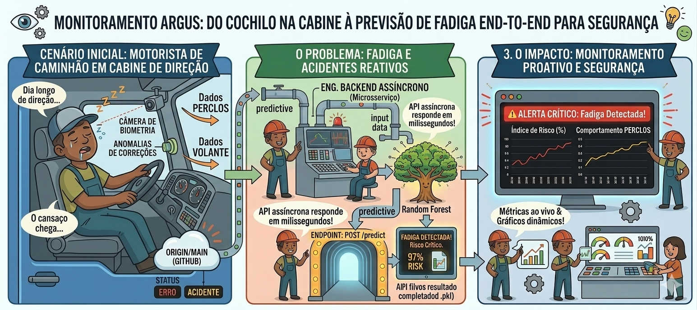
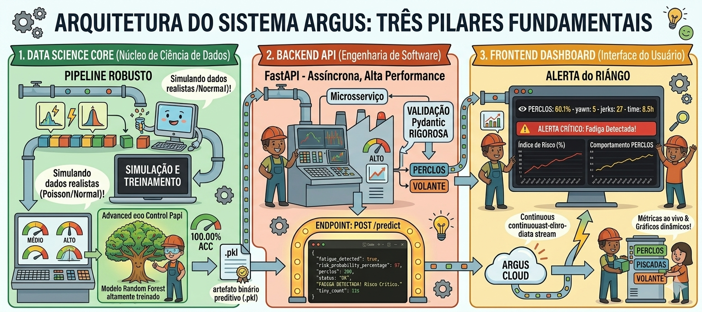
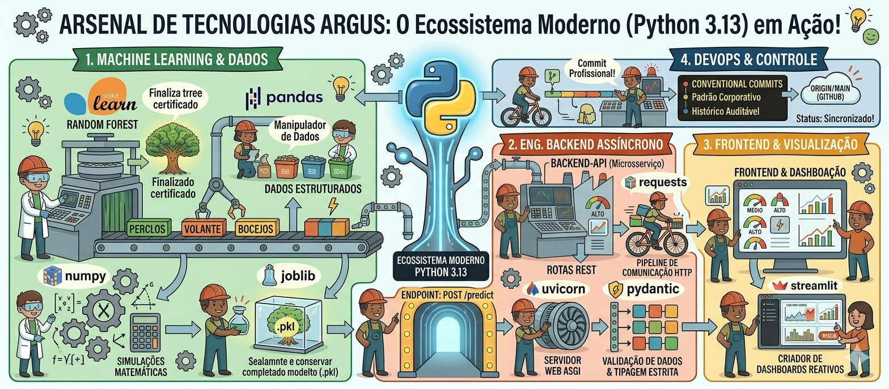

# 👁️ Argus: Sistema Preditivo de Fadiga Humana em Tempo Real

[](https://www.python.org/)
[](https://fastapi.tiangolo.com/)
[](https://streamlit.io/)
[](https://scikit-learn.org/)

---

## 📝 Introdução



Nas indústrias de transporte, logística e operação de maquinário pesado, a fadiga do operador é uma das principais causas de acidentes graves em todo o mundo. As medidas de segurança reativas tradicionais geralmente disparam alertas tarde demais, quando o incidente crítico já está em andamento ou se tornou inevitável.

O **Argus** é um ecossistema de Inteligência Artificial ponta a ponta (*End-to-End*) projetado para prever a fadiga humana antes que ela resulte em um acidente. Através da análise contínua de dados de fluxo de telemetria comportamental e biométrica da cabine, como a taxa de fechamento dos olhos, PERCLOS, frequência de bocejos e anomalias de micro-correções no volante, o Argus calcula instantaneamente um perfil de probabilidade de risco. Isso permite que centrais de monitoramento e frotas intervenham proativamente, garantindo a integridade do operador e a segurança da operação.

---

## 📊 Resumo do Projeto & Arquitetura



O sistema foi desenhado seguindo uma arquitetura desacoplada e baseada em microsserviços, dividida em três pilares fundamentais:

1. **Data Science Core (Núcleo de Ciência de Dados):** Um pipeline robusto que simula dados realistas de telemetria veicular utilizando distribuições estatísticas (Poisson e Normal). Ele utiliza um modelo de classificação **Random Forest** altamente treinado para mapear padrões de sonolência, exportando um artefato binário preditivo de alta performance (`.pkl`).
2. **Backend API (Engenharia de Software):** Uma aplicação **FastAPI** assíncrona e de alta performance que carrega o modelo treinado em memória. O microsserviço garante a consistência dos dados em tempo de execução através de validações rígidas com esquemas **Pydantic**, expondo um endpoint de baixíssima latência (`POST /predict`) que retorna inferências em milissegundos.
3. **Frontend Dashboard (Interface do Usuário):** Uma aplicação web reativa construída em **Streamlit** que simula o fluxo contínuo de sensores de um veículo em movimento. O painel comunica-se assincronamente com a API Backend para renderizar métricas ao vivo, gráficos de tendência temporal de risco e alertas visuais críticos para o operador.


---

## 🛠️ Tecnologias Utilizadas & Stack Técnica



O ecossistema foi desenvolvido inteiramente utilizando o ecossistema moderno do **Python 3.13**, adotando bibliotecas que são padrão de mercado na indústria de tecnologia e IA:

* **Machine Learning & Tratamento de Dados:** `scikit-learn` (implementação do algoritmo Random Forest e divisão de treino/teste), `pandas` (manipulação de dados estruturados), `numpy` (simulações matemáticas e conversão de vetores) e `joblib` (serialização e persistência do modelo).
* **Engenharia de Backend Assíncrono:** `FastAPI` (construção e design de rotas REST), `uvicorn` (servidor web ASGI de alta performance) e `pydantic` (validação de dados e tipagem estrita).
* **Frontend & Visualização de Dados:** `streamlit` (construção de dashboards reativos e plotagem gráfica ao vivo) e `requests` (pipeline de comunicação HTTP).
* **DevOps & Controle de Versão:** `Git` com a adoção rigorosa do padrão **Conventional Commits** para a manutenção de um histórico de mensagens profissional e auditável.

---

## 🚀 Como Executar o Projeto Localmente

### Pré-requisitos
Certifique-se de ter o **Python 3.13** instalado em sua máquina.

### 1. Clonar o Repositório e Configurar o Ambiente Virtual
```powershell
# Clone este repositório
git clone [https://github.com/viniciushoffmanndev/fatigue-predictive-system.git](https://github.com/viniciushoffmanndev/fatigue-predictive-system.git)
cd fatigue-predictive-system

# Criar e ativar o ambiente virtual (venv)
python -m venv venv
.\venv\Scripts\Activate

# Instalar as Dependências do Projeto
pip install -r requirements.txt

# Treinar o modelo de Machine Learning
python data-science-core/src/train_model.py

Este comando executará o simulador estatístico, gerará o dataset de treino e exportará o arquivo binário fatigue_rf_model.pkl na pasta de modelos.

# Inicializar a API Backend
uvicorn backend-api.src.main:app --reload

A API estará ativa em http://127.0.0.1:8000. Você pode explorar e testar os payloads diretamente na documentação interativa do Swagger acessando /docs.

# Executar o Dashboard Frontend
streamlit run frontend-app/src/app.py

O dashboard interativo será aberto automaticamente no seu navegador padrão no endereço
http://localhost:8501.

```


